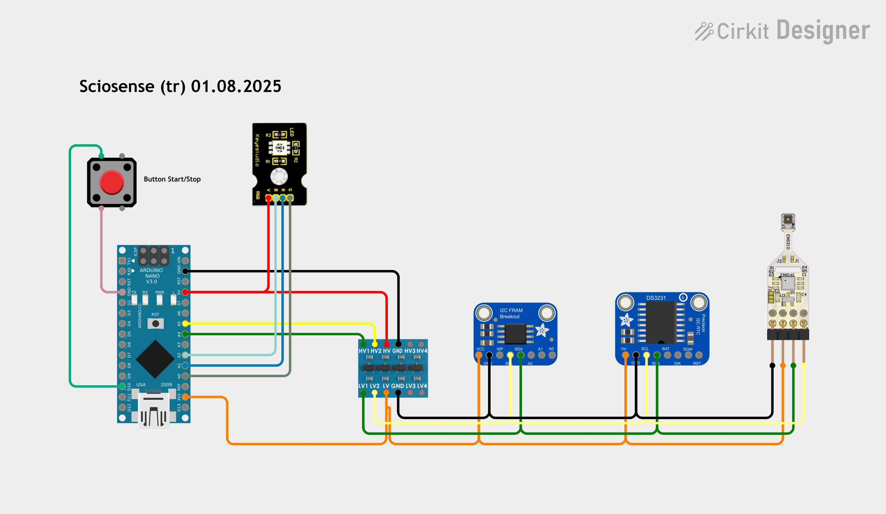

# FRAM-Data-Logger
logging data into FRAM, utilizing RTC and ScioSense ENS16x and ENS210 sensors


This is an easy example of using a FRAM memory along with RTC and ScioSense ENS16x EVKit to create a datalogger. FRAM is less power hungry and enablenearly unlimited write cycles
The used FRAM does support 32.768kB of memory and the currently used setup (V01) allows to store 3276 datasets (10bytes per dataset) including timestamp

## Power
the idea is to have a mobil logger hence it's recommended to power with appropriate supply, e.g. powerbank or dedicated battery plus converter
## Precaution
set Baudrate to 9600 Baud

## Menue
The menue shows available instructions and information, set either while compilaton or during run time
```arduino
****************************
	FRAM Data Logger
C:\Users\myPath\saveToFRAM_V01.ino
19:05:35  Aug  1 2025

Menue:
------
?   this info
d   set date and time
s   START/STOP logging
r   dump logging
m   show/hide measurement
t   set time between measurements (0-255sec)


Memory size (kB): 32768
possible dataset to store:     3274
time between measurements (s): 7
number of stored datasets:     6
```
